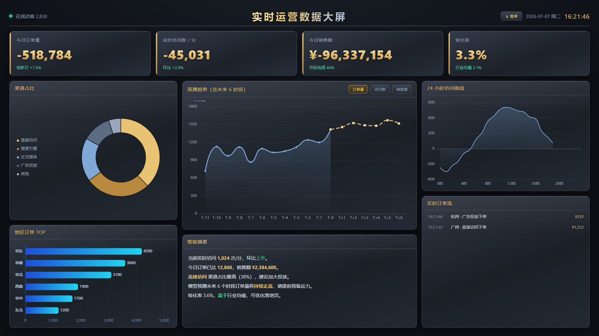

# 数据看板 · effie_databoard

一个数据大屏项目实践，分阶段构建可视化看板。

A data dashboard (big-screen) project, built incrementally for practice.



## 项目简介 / Overview

- 中文名：数据看板
- 英文名：effie_databoard
- 目标：练习并沉淀数据大屏（可视化看板）的开发能力
- 技术栈：原生 HTML + CSS + JS + [ECharts](https://echarts.apache.org/)（零依赖，库已本地内置）
- 协议：MIT License

## 运行方式 / Getting Started

零依赖纯静态大屏，直接用浏览器打开即可：

```bash
# 方式一：双击 index.html
# 方式二：起本地静态服务（推荐，避免个别浏览器限制）
python -m http.server 8080
# 然后访问 http://localhost:8080
```

数据均为前端定时器模拟实时变化，无需后端。

## 功能介绍 / Features

### 1. 顶部 KPI 卡片
实时跳动的四项核心指标，带环比/目标完成率：
- **今日订单量**：每秒随机增长，并显示较昨日涨幅
- **实时访问数 / 分**：实时波动，并显示环比变化
- **今日销售额**：累计金额，显示目标完成百分比
- **转化率**：实时微调，对照行业均值

### 2. 渠道占比（左图例 + 右环形）
- 图例竖排于左侧，环形图在右侧，布局清爽
- **可交互**：点击任意渠道扇形，其余变暗聚焦，并在智能摘要中插入该渠道分析；再次点击取消聚焦

### 3. 地区订单 TOP（条形图）
各区域订单量横向排名，渐变蓝色条，每隔几秒微调。

### 4. 预测趋势（折线图，可切换指标）
- 实线为「实际」、虚线为「未来 6 个时段预测」，含阴影面积
- **可交互**：标题处「订单量 / 访问数 / 销售额」按钮切换指标，坐标轴随之变化（销售额按"万"显示）

### 5. 24 小时访问曲线（面积折线）
展示全天访问走势，当前小时随实时访问数滚动更新。

### 6. 实时订单流（滚动列表）
每秒新增一条带时间、地区、渠道、金额的订单，最多保留 12 条，新单滑入动画。

### 7. 智能摘要
根据当前指标自动生成文字洞察（实时访问、订单、销售额、占比最高渠道、预测走势、转化率对比）。

### 8. 全局暂停 / 继续
右上角按钮可暂停实时数据跳动（时钟继续走），便于观察某时刻或截图。

## 目录结构 / Structure

```
.
├── index.html        # 页面结构
├── style.css         # 大屏深色科技风样式
├── app.js            # 数据模拟与图表逻辑（含交互）
├── echarts.min.js    # 本地内置 ECharts 库
├── preview.png       # 运行效果预览图
├── README.md         # 项目说明
└── LICENSE           # MIT 开源协议
```

## 开发计划 / Roadmap

- [x] 阶段一：项目脚手架、基础布局与核心图表
- [x] 阶段一（增强）：交互（指标切换 / 饼图聚焦 / 暂停实时）
- [x] 阶段二：大屏自适应缩放（基于 1920×1080 设计稿等比 scale，不变形）
- [x] 阶段二（增强）：金属质感深色主题（枪灰拉丝 + 金/钢蓝高光）
- [ ] 阶段三：接入真实数据接口（替换模拟数据）
- [ ] 阶段四：部署（GitHub Pages / Gitee Pages）

## 许可证 / License

[MIT](LICENSE) © effie
